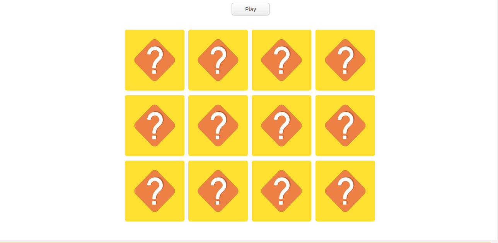
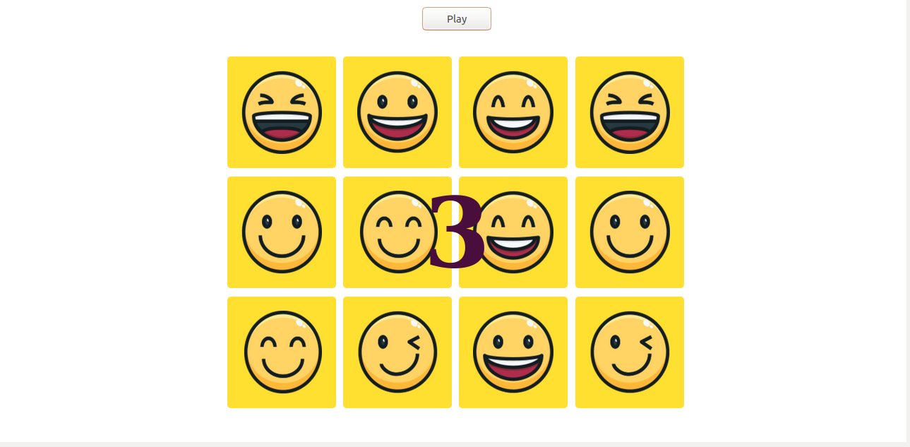
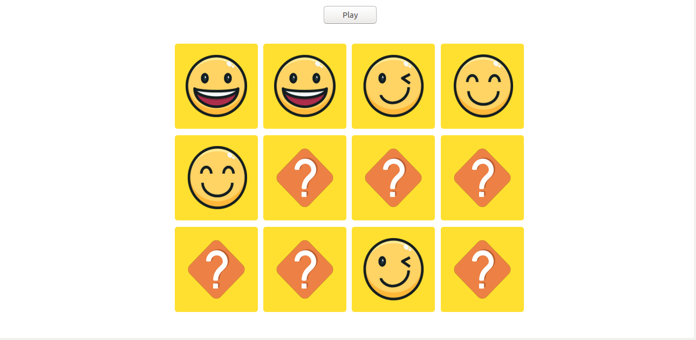
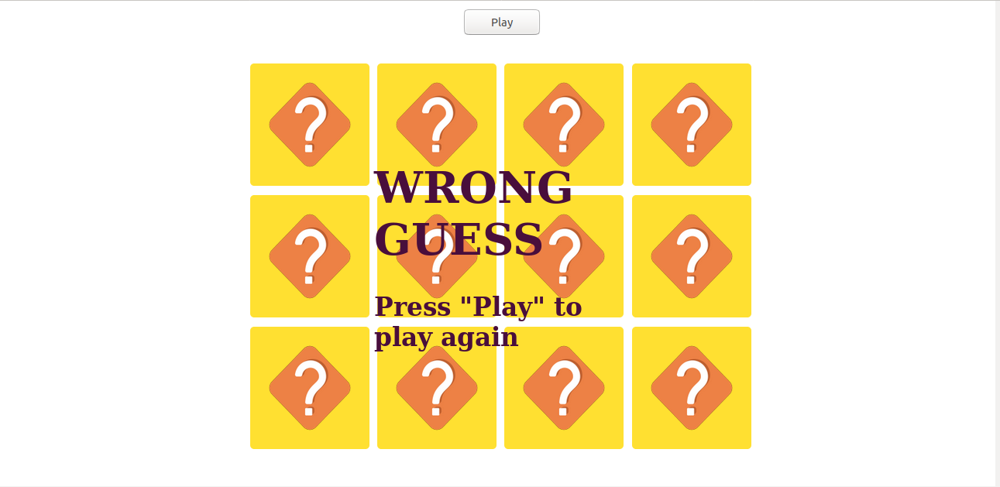
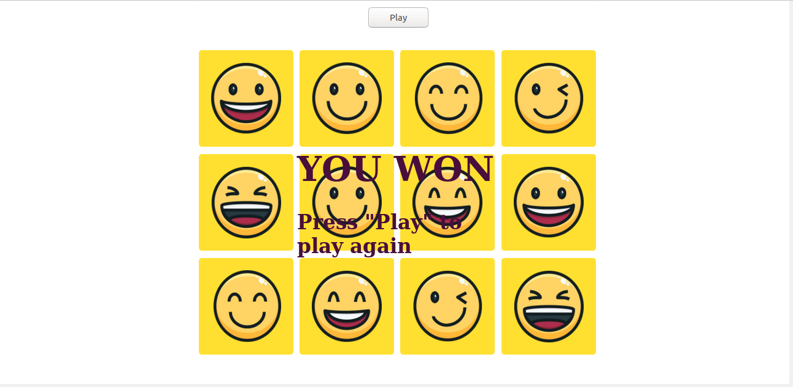

# memory-puzzle
This is repository for homework assignment from Visma

**Starting the game**

To start the game you need to press "Play button".

**Memorize the board**

After game is started you get 5 seconds to memorize the board.

**Try to find the pairs**

When timer hits 0, cards flip around and it's time to match all the pairs. The cards are shuffled after every game. 
Also if you guess wrong you need to start again. 

**Winning**

To win you need to match all the pairs without making a single mistake.

